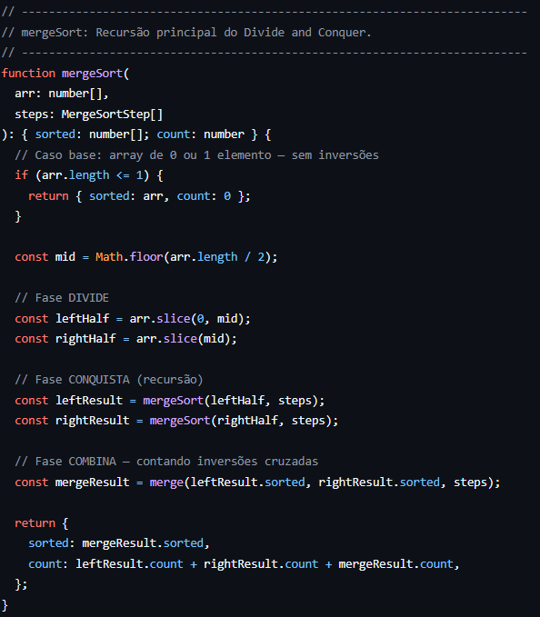
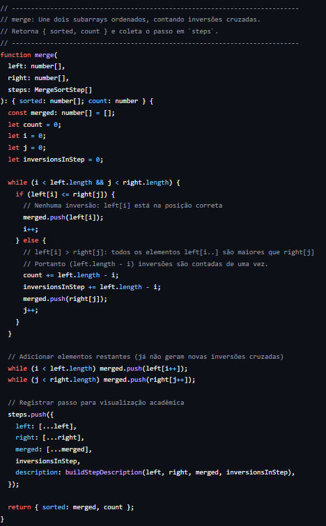
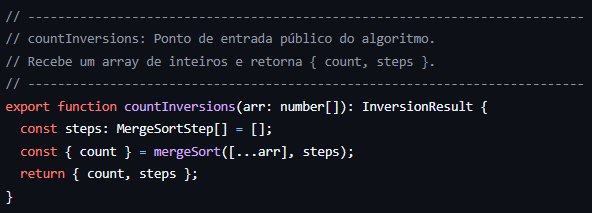
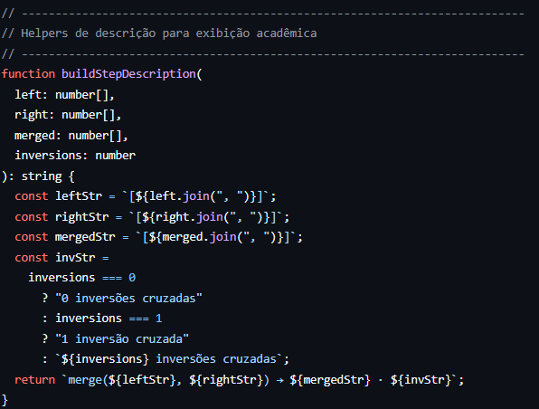

Temas:
 - Dividir e Conquistar

# In Sync — Jogo de Sintonia

**Conteúdo da Disciplina**: Dividir e Conquistar<br>

## Alunos

| Matrícula  | Aluno                     |
| ---------- | ------------------------- |
| 232014638  | Caio Soares de Andrade    |
| 231011408  | Guilherme Flyan Araujo    |

## Sobre

O **In Sync — Jogo de Sintonia** é uma aplicação web interativa e pedagógica que demonstra o funcionamento do algoritmo dividir e conquistar **Counting Inversions**. Os jogadores de cada dupla formam uma lista cada um rankeando de acordo com o tema suas preferências, por fim a dupla que tiver menos inversões é a dupla com maior sintonia e vence o jogo.

## Screenshots







## Instalação

**Linguagem**: TypeScript<br>
**Framework**: Next.js 16 (App Router)<br>
**Estilização**: Tailwind CSS 4<br>
**Pré-Requisitos**: Node.js v20+<br>
### Acesso deploy
[In Sync - Jogo de Sintonia](https://g7-dividir-e-conquistar-in-sync.vercel.app/)

### Como rodar localmente

```bash
# 1. clone o repositório
git clone https://github.com/projeto-de-algoritmos-2026/G7-Dividir-e-Conquistar--In-Sync.git

# 2. entre na pasta do projeto
cd G7-Dividir-e-Conquistar--In-Sync

# 3. instale as dependências
npm install

# 4. inicie o servidor de desenvolvimento
npm run dev
```

A aplicação estará disponível em **http://localhost:3000**.

## Outros

O projeto **não utiliza backend separado** — toda a lógica do algoritmo roda nas API Routes do Next.js (server-side), mantendo a arquitetura unificada em um único framework.

## Video explicativo
[Vídeo](https://youtu.be/NU1PGA_JMHo)

